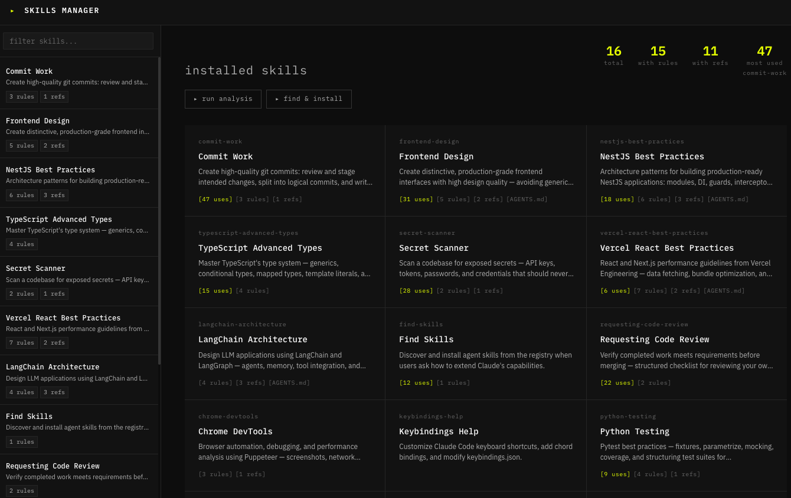

<div align="center">

# Skills Manager

**A local web UI for browsing, editing, and AI-analyzing your [Claude Code](https://claude.ai/claude-code) agent skills.**

[](LICENSE)
[](https://nodejs.org)
[](https://www.typescriptlang.org)
[](https://nestjs.com)
[](https://react.dev)
[](https://vitejs.dev)



</div>

---

## Features

### Skill Library
- Browse all installed skills with live search and filter
- Rule count, reference file count, and usage frequency per skill at a glance
- "Most used" and total skill count stats in the header

### Skill Detail
- Collapsible sections for **SKILL.md**, **RULES**, **USAGE**, and **REFERENCES**
- Full markdown rendering with heading hierarchy, code blocks, tables, and lists
- Edit SKILL.md and individual rule files inline — changes write directly to disk
- Per-rule metadata: title, impact level (CRITICAL / HIGH / MEDIUM / LOW)
- **AI Summary** — one-click summary generated via Claude or Gemini

### Usage Tracking
- Parses `~/.claude/projects/**/*.jsonl` (Claude Code conversation logs)
- Shows invocation count, last-used date, and which project triggered each skill
- Captures the human prompt that caused Claude to invoke the skill
- Incremental cache (`~/.agents/skills-manager-usage.json`) — only re-parses changed files

### AI Analysis
- **Duplicate Detection** — finds skills with overlapping purposes, scored high / medium / low
- **Thematic Connections** — groups skills into clusters by domain

### Find & Install
- Search the public skill registry via `npx skills find`
- One-click **use** button to pre-fill the install input
- Check for and apply updates to all skills in one action

---

## Tech Stack

| Layer | Technology |
|-------|-----------|
| API | NestJS 10, TypeScript (ESM), SWC |
| Frontend | React 18, Vite, TanStack Query v5 |
| AI | Claude (`claude-sonnet-4-6`) or Gemini (`gemini-2.0-flash`) |
| Skills CLI | `npx skills` |

---

## Prerequisites

- **Node.js** ≥ 20
- **pnpm** ≥ 9 — `npm install -g pnpm`
- **Claude Code** with skills installed at `~/.agents/skills/`
- An **Anthropic API key** (or Gemini API key if you prefer Gemini)

---

## Installation

```bash
# 1. Clone the repo
git clone https://github.com/MiranNadav/skills-manager.git
cd skills-manager

# 2. Install dependencies
pnpm install

# 3. Configure the API
cp apps/api/.env.example apps/api/.env
```

Edit `apps/api/.env`:

```env
PORT=3001
CORS_ORIGINS=http://localhost:5173

# Path to your skills directory (defaults to ~/.agents/skills)
SKILLS_PATH=

# AI provider: "claude" or "gemini"
AI_PROVIDER=claude

# Required for Claude
ANTHROPIC_API_KEY=sk-ant-...

# Required for Gemini (alternative)
# GEMINI_API_KEY=AIza...
```

```bash
# 4. Start both services
pnpm dev
```

| Service | URL |
|---------|-----|
| Web UI | http://localhost:5173 |
| API | http://localhost:3001 |
| Swagger | http://localhost:3001/api/docs |

---

## Development

```bash
pnpm dev          # api + web in parallel
pnpm dev:api      # api only
pnpm dev:web      # web only
pnpm typecheck    # type-check all packages
pnpm test         # run tests
pnpm build        # production build
```

### Project Structure

```
skills-manager/
├── apps/
│   ├── api/                  # NestJS backend (port 3001)
│   │   └── src/
│   │       └── modules/
│   │           ├── skills/   # Skill file parsing & CRUD
│   │           ├── analysis/ # AI analysis (summary, duplicates, connections)
│   │           ├── usage/    # JSONL parsing & usage stats
│   │           ├── ai/       # AI provider abstraction (Claude / Gemini)
│   │           └── cli/      # npx skills CLI wrapper
│   └── web/                  # Vite + React frontend (port 5173)
│       └── src/
│           ├── pages/        # DashboardPage, SkillPage, AnalysisPage, InstallPage
│           ├── api/          # Typed API clients
│           └── hooks/        # TanStack Query hooks
└── tsconfig.base.json
```

---

## Skills Directory

Skills are read from `~/.agents/skills/` by default. Each skill is a directory:

```
~/.agents/skills/
└── commit-work/
    ├── SKILL.md          # Main skill prompt
    ├── rules/            # Additional rule files (.md)
    ├── references/       # Reference documents
    └── AGENTS.md         # Optional agent config
```

To install skills from the public registry:

```bash
npx skills add owner/repo@skill-name
```

Or use the **Install** tab in the UI.

---

## Contributing

See [CONTRIBUTING.md](CONTRIBUTING.md).

---

## License

MIT — see [LICENSE](LICENSE).
